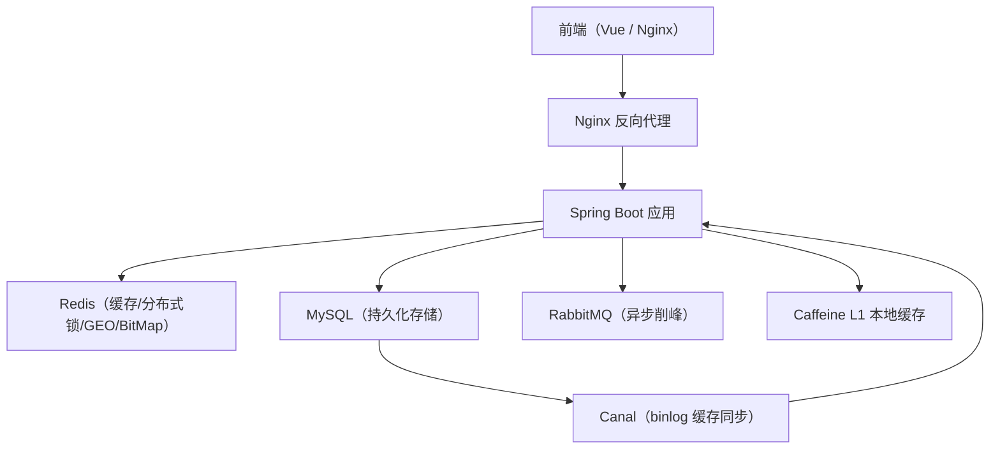
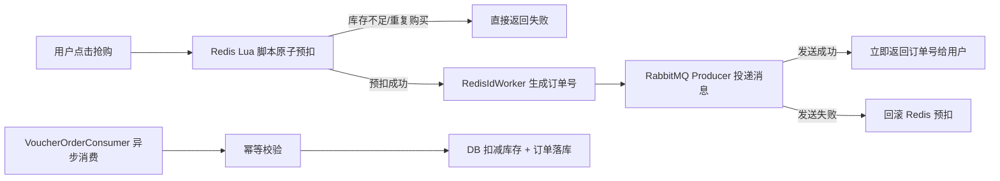
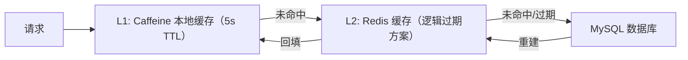
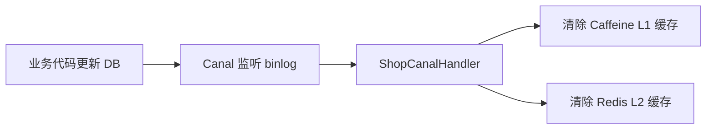

# Campus Store Area — 项目学习文档

> 基于"黑马点评"课程深度改造的本地生活服务平台，面向校园商圈的商铺发现、笔记分享、秒杀抢购等核心场景。

---

## 一、项目概述

| 维度 | 说明 |
|:---|:---|
| **项目名称** | Campus Store Area（校园商圈点评平台） |
| **项目角色** | 独立开发（后端） |
| **核心功能** | 商铺浏览与搜索、笔记发布与社交互动、限时秒杀抢购、用户签到 |
| **技术栈** | Java 17 + Spring Boot 2.7 + MyBatis-Plus + MySQL + Redis + Redisson + RabbitMQ + Caffeine + Canal + Docker Compose |

---

## 二、系统架构图



---

## 三、核心模块详解

### 3.1 高并发秒杀系统

**技术关键词：** Redis Lua 原子预扣 + RabbitMQ 异步落库 + 可靠性三板斧

#### 整体流程



#### 设计要点

| 环节 | 技术方案 | 解决的问题 |
|:---|:---|:---|
| **库存预扣** | Redis Lua 脚本原子执行（判库存 → 判一人一单 → 扣减 → 记购买标记） | 超卖问题、一人一单限制 |
| **异步落库** | RabbitMQ Direct Exchange + 持久化队列 | 同步落库阻塞主线程，QPS 低 |
| **消息可靠性** | Publisher Confirm + 消息持久化 + 手动 ACK | 消息丢失问题 |
| **消费幂等** | 落库前按订单 ID 查询 + DB 唯一索引兜底 | 消息重发导致重复落库 |
| **失败补偿** | 补偿表（自动重试）→ ErrorLogService（DB + 本地文件降级） | 消费失败后消息不丢失 |
| **订单号生成** | RedisIdWorker（时间戳 32bit + Redis INCR 序列号 32bit） | 分布式全局唯一、趋势递增 |

#### Lua 脚本核心逻辑

```lua
-- 参数：ARGV[1]=voucherId, ARGV[2]=userId
-- 返回：0=成功 / 1=库存不足 / 2=重复下单
local stockKey = 'seckill:stock:' .. ARGV[1]
local orderKey = 'seckill:order:' .. ARGV[1]

local stock = tonumber(redis.call('get', stockKey) or '0')
if stock <= 0 then return 1 end
if redis.call('sismember', orderKey, ARGV[2]) == 1 then return 2 end

redis.call('incrby', stockKey, -1)
redis.call('sadd', orderKey, ARGV[2])
return 0
```

#### JMeter 压测数据（200 并发）

| 指标 | 数值 |
|:---|:---|
| 平均响应时间 | 101ms |
| 99 分位响应 | 148ms |
| 错误率 | 0.00% |
| 吞吐量 | 956.9/sec |

---

### 3.2 多级缓存体系

**技术关键词：** Caffeine L1 + Redis L2 + 逻辑过期 + 互斥锁 + 随机 TTL

#### 缓存架构



#### 缓存三大问题解决方案

| 问题 | 方案 | 实现细节 |
|:---|:---|:---|
| **缓存穿透** | 空值缓存 | DB 查无结果时缓存空串 `""`，短 TTL（2min），拦截恶意 ID |
| **缓存击穿** | 逻辑过期 + 异步重建 | 缓存不设置物理 TTL，通过 `RedisData.expireTime` 字段判断逻辑过期；过期后获取分布式锁异步重建，其他线程返回旧数据 |
| **缓存击穿（备选）** | 互斥锁 + DoubleCheck | `SETNX` 获取锁 → DoubleCheck 缓存 → 查 DB 重建 → 释放锁；未获锁线程 sleep(50ms) 重试 |
| **缓存雪崩** | 随机化 TTL | 基准 TTL ± 20% 随机偏移，避免大量 key 同时过期 |

#### 缓存一致性（Canal binlog 监听）



业务代码只需更新 DB，无需手动删缓存；Canal 捕获 ROW 格式 binlog 后自动触发缓存失效，实现缓存与 DB 的最终一致性。

---

### 3.3 GEO 附近商铺

**技术关键词：** Redis GEO + GEORADIUS + Haversine 距离计算

#### 实现方案

| 排序方式 | 技术实现 | 说明 |
|:---|:---|:---|
| **按距离** | Redis `GEORADIUS` + `includeDistance` + `sortAscending` | 5km 范围内按距离升序分页，批量查 DB 后保持 GEO 排序 |
| **按人气** | DB `ORDER BY comments DESC` + Haversine 公式计算距离 | 适合需要精确排序的场景 |
| **按评分** | DB `ORDER BY score DESC` + Haversine 公式计算距离 | 同上 |

- **数据初始化：** `@PostConstruct` 启动时全量加载商铺坐标到 `shop:geo:{typeId}` GEO 集合
- **增量同步：** 新增/更新商铺时调用 `GEOADD` 同步坐标变更

---

### 3.4 Redis BitMap 签到系统

**技术关键词：** BitMap + BITCOUNT + BITFIELD

| 功能 | Redis 命令 | 说明 |
|:---|:---|:---|
| 签到 | `SETBIT key offset 1` | offset = 日期 - 1 |
| 签到判重 | `GETBIT key offset` | 返回 1 则已签到 |
| 本月签到天数 | `BITCOUNT key` | 统计值为 1 的 bit 数 |
| 连续签到天数 | `BITFIELD key GET u{dayOfMonth} 0` | 一次取回整段 bit，从今天往回数遇到 0 停止 |
| 月度签到记录 | `BITFIELD key GET u{daysInMonth} 0` | 遍历整月 bit 值 |

**内存优势：** 单用户单月仅占 **4 字节**（31 bit），百万用户签到只需 4MB，远优于 SET/HASH 方案。

---

### 3.5 关注体系与 Feed 流

**技术关键词：** Redis SET + 滚动分页 + 关注 Feed

#### 关注体系

| 操作 | Redis 命令 | 说明 |
|:---|:---|:---|
| 关注 | `SADD follows:{userId} {targetId}` + DB insert | Redis + MySQL 双写 |
| 取关 | `SREM` + DB delete | 双写一致性 |
| 是否已关注 | `SISMEMBER` | O(1) 复杂度 |
| 共同关注 | `SINTER` | 两个 SET 取交集 |
| 关注数 | `SCARD` | SET 成员数量 |

#### 关注 Feed 滚动分页

传统 `LIMIT offset, size` 在深度分页时性能差（MySQL 扫描 offset+size 行丢弃前 offset 行），且用户翻页期间新数据插入会导致数据偏移。

**滚动分页方案：** 前端传 `lastId`（上一页最后一条的时间戳）+ `offset`（同秒跳过条数），后端查 `create_time < lastId` 按时间倒序取一页，不受新数据影响，性能恒定。

---

### 3.6 博客点赞系统

**技术关键词：** Redis SET 状态切换 + 防负数保护

```
SISMEMBER blog:liked:{blogId} → 判断是否已赞
├── 已赞 → SREM + DB liked-1（WHERE liked > 0 防负数）
└── 未赞 → SADD + DB liked+1
```

- 查询博文详情时额外调用 `SISMEMBER` 填充 `isLike` 字段
- 查询点赞用户列表从 SET 取成员，批量查 DB 返回 UserDTO

---

## 四、工程化改造亮点

### 4.1 统一响应体与链路追踪

- **响应体增强：** `Result` 增加 `traceId` + `timestamp`，通过 MDC 自动透传
- **TraceIdInterceptor：** 每个请求自动分配 traceId（支持前端 `X-Trace-Id` 透传），写入 MDC 供日志和响应体使用
- **三层拦截器链：** `TraceId(-2) → RefreshToken(0) → Login(1)`，显式 order 控制执行顺序

### 4.2 全局异常处理体系

| 异常类型 | 处理方式 | 日志级别 |
|:---|:---|:---|
| `BusinessException` | 返回业务错误信息 | warn |
| `MethodArgumentNotValidException` | 返回字段级错误（如 `phone:手机号格式错误`） | warn |
| `BindException` | 表单绑定校验失败 | warn |
| `RuntimeException` | 兜底系统异常，带 traceId | error |

### 4.3 参数校验与 DTO 规范

- 引入 JSR-303 Bean Validation，手机号正则、验证码格式等校验从 Service 下沉到 DTO 注解
- `@Valid` 触发校验，错误信息自动携带字段名，由全局异常处理器统一处理

### 4.4 错误日志降级服务

`ErrorLogService` 实现两级降级：
1. **第一层：** 写入 `error_log` 数据库表
2. **第二层：** DB 写入失败时自动降级到本地文件 `error_log_fallback.log`

保证异常信息不丢失，且不会因日志记录失败影响主业务流程。

---

## 五、DevOps 与部署

### Docker Compose 一键编排

| 服务 | 镜像 | 端口 | 持久化 |
|:---|:---|:---|:---|
| MySQL | mysql:8 | 3307:3306 | 命名卷 `mysql-data` |
| Redis | redis:latest | 6379:6379 | external 命名卷 |
| RabbitMQ | rabbitmq:3.13-management | 5672 / 15672 | 命名卷 `rabbitmq-data` |
| Nginx | nginx:1.30.2 | 8080:8080 | 挂载配置文件 + 静态资源 |

Nginx 做反向代理：`/api/` 转发到后端 upstream，`/imgs/` 代理解决跨机器图片访问。

---

## 六、Redis 数据结构总览

| Key 格式 | 数据结构 | 用途 | 所在模块 |
|:---|:---|:---|:---|
| `login:token:{token}` | HASH | 登录用户信息 | 用户鉴权 |
| `login:code:{phone}` | String | 短信验证码 | 登录 |
| `sign:{userId}:{yyyy:MM}` | BitMap | 月度签到记录 | 签到 |
| `follows:{userId}` | SET | 关注列表 | 关注 |
| `blog:liked:{blogId}` | SET | 点赞用户集合 | 点赞 |
| `cache:shop:{id}` | String(JSON) | 商铺详情缓存 | 缓存 |
| `lock:shop:{id}` | String | 分布式互斥锁 | 缓存 |
| `seckill:stock:{voucherId}` | String | 秒杀库存 | 秒杀 |
| `seckill:order:{voucherId}` | SET | 秒杀一人一单 | 秒杀 |
| `shop:geo:{typeId}` | GEO | 商铺地理位置 | GEO 搜索 |
| `icr:{keyPrefix}:{date}` | String | RedisIdWorker 自增序列 | ID 生成 |

---

## 七、面试高频问题速答

### Q1：秒杀如何防止超卖？

> 使用 Redis Lua 脚本原子执行库存判减操作。Lua 脚本在 Redis 单线程中执行，天然保证原子性，无需加锁。判断库存 > 0 后 `INCRBY -1`，同时用 `SADD` 记录用户购买标记实现一人一单。

### Q2：为什么选择 RabbitMQ 而不是 Redis Stream？

> Redis Stream 是单线程 `while(true)` 消费模型，不支持弹性扩容；RabbitMQ 的 `@RabbitListener` 支持 `concurrency=5-10` 弹性线程池，消息堆积时自动扩容。RabbitMQ 还提供了 Publisher Confirm + Returns + 手动 ACK 的可靠性三板斧，生态更成熟。

### Q3：缓存与数据库一致性怎么保证？

> 采用 Canal 监听 MySQL binlog 变更事件。业务代码只更新 DB，Canal 捕获 ROW 格式 binlog 后自动清除 Caffeine L1 + Redis L2 缓存，实现业务代码与缓存失效的解耦。更新 DB 时同步删缓存作为双保险。

### Q4：如何解决缓存击穿？

> 生产环境使用逻辑过期方案：缓存不设物理 TTL，通过 `RedisData.expireTime` 字段判断是否过期。过期后一个线程获取分布式锁异步重建缓存，其他线程直接返回旧数据，保证接口不阻塞。同时互斥锁方案作为备用已实现。

### Q5：Token 存储为什么用 Redis 而不是 JWT？

> Redis Token 支持主动失效（登出时删除）、单点登录、踢人下线等场景。JWT 签发后无法主动失效，只能等过期。本项目 Token 有效期 30 天，每次请求由 `RefreshTokenInterceptor` 自动续期，实现滑动窗口过期效果。

### Q6：消息消费失败怎么办？

> 设计了两层降级链：第一层写入 `mq_failed_order` 补偿表，定时任务自动重试；第二层通过 `ErrorLogService` 写入错误日志表（DB 失败自动降级到本地文件）。无论哪层成功，最终都 ACK 出队，防止消息无限循环。

### Q7：签到为什么用 BitMap？

> BitMap 本质是 String 类型的 bit 数组，一个月 31 天只需 4 字节。百万用户签到数据仅占 4MB 内存。`SETBIT` 签到、`GETBIT` 判重、`BITCOUNT` 统计天数、`BITFIELD` 一次取回整段 bit 值做连续签到计算，时间复杂度和空间复杂度都极优。

---

## 八、项目亮点总结（简历用）

1. **高并发秒杀：** 基于 Redis Lua 原子预扣 + RabbitMQ 异步落库实现高吞吐秒杀，JMeter 200 并发压测平均响应 101ms，0 错误率，吞吐量 957/sec
2. **多级缓存：** Caffeine 本地缓存 + Redis 分布式缓存，通过逻辑过期 + 随机 TTL 解决缓存穿透/击穿/雪崩三大问题
3. **缓存一致性：** 基于 Canal 监听 MySQL binlog 自动失效缓存，实现业务与缓存解耦
4. **消息可靠性：** RabbitMQ 可靠性三板斧（Publisher Confirm + 消息持久化 + 手动 ACK），消费失败两层降级（补偿表 + 错误日志服务）
5. **Redis 多场景应用：** BitMap 签到（4 字节/用户/月）、GEO 附近商铺搜索、SET 关注/点赞、Lua 原子库存预扣
6. **工程规范：** 统一响应体 + traceId 链路追踪、JSR-303 参数校验、全局异常三分处理、Docker Compose 一键部署
